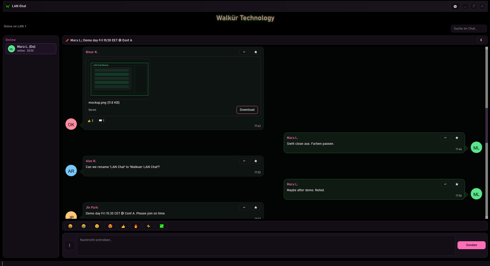
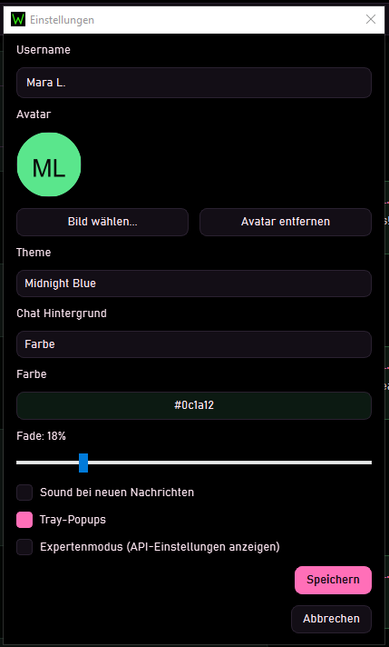
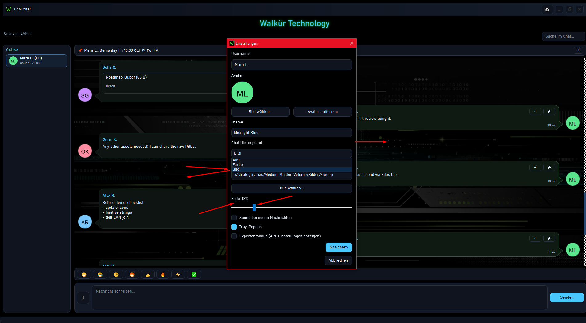

# Walkür LAN Chat

<div align="center">
  
  <p><strong>Global LAN chat for Windows - clicky-colorful, fast, no server.</strong></p>
  <p>Walkür Technology · Strategus One · Silvan Fülle</p>

  <hr>
  <p align="center">
    <a href="https://github.com/PrivTEC/Walkuer_Lan_Chat/releases/tag/v1.0.0"
      style="color:#3fb950; text-decoration:none;">
      <strong style="font-size:1.3em; letter-spacing:0.5px;">
        ┏━━━━━━━━━━━━━━━━━━━━━━━━━━━━━━┓<br>
        ┃ ⬇ DOWNLOAD WINDOWS EXE v1.0.0 ┃<br>
        ┗━━━━━━━━━━━━━━━━━━━━━━━━━━━━━━┛
      </strong>
    </a>
  </p>
  <p align="center">
    Single-file executable · No installer · No server · No cloud
  </p>
  <hr>

  <p>
    <a href="API.md">API</a> ·
    <a href="#features">Features</a> ·
    <a href="#functions-in-detail">Functions</a> ·
    <a href="#screenshots">Screenshots</a> ·
    <a href="#getting-started">Getting Started</a> ·
    <a href="LICENSE.md">License</a>
  </p>
</div>

Walkür LAN Chat is a compact Windows tool for local network chat: one global room in your intranet, automatic discovery via UDP multicast, file transfer via local HTTP, and a dark neon UI in Walkür style. No server, no cloud service, no internet required.

<div align="center">
  
</div>

## Features
- Global LAN chat (UDP multicast, one room for everyone): **239.255.77.77:51337**
- Auto-discovery + presence (online/last seen, “typing…”)
- Modern chat bubbles with **side-tail** pointing to the avatar, reply quote, reactions, edit/undo, pin bar
- **WhatsApp-style link preview** in the composer: title, description, thumbnail, dismissable via X
- Link preview is sent along (including thumbnail hosting on the LAN), rendered as a preview card in chat
- QR code for links: **toggle via button** (not always in the way)
- File transfer: drag-and-drop, download via HTTP URL, progress + retry, inline image preview
- Chat background: **Off / Color / Image** + opacity/fade slider
- Themes: Standard, Pink Pupa, Midnight Blue, Mono Minimal
- Tray mode + notifications (optional sound)
- Local API (optional, token-protected) for automations
- Persistence: history + attachments + avatars under `%USERPROFILE%\.walkuer-lanchat\`

## Functions in Detail
- Chat & formatting: Markdown-light with clickable links, safe fallback, text limit **8 KB**.
- Interactions: reply (quote), reactions, edit/undo, pin bar with jump to message.
- Link preview:
  - In the composer: preview card appears automatically when a URL is in the text (dismissable via X).
  - On send: meta info is transmitted; thumbnails are served via the built-in HTTP server on the LAN.
  - Debug: `link_preview.log` under `%USERPROFILE%\.walkuer-lanchat\logs\` (only on partial/fail).
- Presence: online list, last-seen timestamp, “typing…” status.
- Files: drag-and-drop, local HTTP download, progress + retry, inline image preview.
- Offline queue: messages are buffered during network loss and sent later.
- Persistence: `history.jsonl`, `attachments/`, `avatars/`, `logs/` under `%USERPROFILE%\.walkuer-lanchat\`.

## Why it’s special
Compact, fast, local-first. For teams, studios, workshop, office, LAN events. No accounts, no server costs, no cloud dependency. Just start and chat - with Walkür UI and proper “system feel”.

## Screenshots
<div align="center">
  
  
  
  
</div>

## Getting Started
### Dev
1. Install Python 3.11+
2. `run_dev.bat`

### Build (EXE)
1. `build_exe.bat`
2. Output: `dist\WalkuerLanChat.exe`

## Usage
1. Start the app on two PCs in the same LAN.
2. Windows Firewall may ask on first launch: allow access (Private network).
3. Chat, post links (composer preview), drag files - done.

## Settings
- Username freely selectable.
- Choose/remove avatar (round, with border).
- Theme selection: Standard, Pink Pupa, Midnight Blue, Mono Minimal.
- Language: multilingual UI (i18n JSON).
- Chat background: Off / Color / Image + opacity/fade.
- Sound on new messages (on/off).
- Tray popups (on/off).
- Enable local API: show URL + token, regenerate token.
- Expert Mode: reveals advanced options (if enabled).

## Tech (Short)
- UI: **PySide6 (Qt Widgets)**, themes via QSS, splash screen via SVG.
- Network: UDP multicast (discovery + chat), JSON messages, rate-limited presence.
- Files & thumbnails: embedded HTTP server (local), caching in `attachments/`.
- Storage: `history.jsonl` + attachments/avatars/logs in the user home directory.
- i18n: language files under `src/lang/*.json`.

## API (local)
See `API.md` for details. Quick overview:
- `GET /api/v1/` Self-description
- `GET /api/v1/status` Status + API URL
- `GET /api/v1/peers` Online peers
- `GET /api/v1/messages?limit=50` History
- `POST /api/v1/send` Send text
- `POST /api/v1/send/file` Send file (local path)
- `POST /api/v1/pin` / `POST /api/v1/unpin`
- `POST /api/v1/edit` / `POST /api/v1/undo`

**Quickstart (PowerShell)**
```powershell
$token = "<token>"
$base = "http://127.0.0.1:<port>/api/v1"
curl.exe "$base/status"
curl.exe -H "X-API-Token: $token" -H "Content-Type: application/json" `
  -d "{\"text\":\"test\"}" "$base/send"
```

## Search & Keywords
LAN Chat, Windows LAN Chat, LAN Messenger, Intranet Chat, Local-first Chat, UDP Multicast, PySide6, Python 3.11, Walkür Technology, Strategus One, Silvan Fülle

## Attribution & License
Free to use for **non-commercial purposes**. Commercial use is prohibited.

Attribution is required when using/redistributing:
- Walkür Technology
- Strategus One
- Silvan Fülle
- https://walkuer.tech
- https://strategus.one

See `LICENSE.md` for details.
