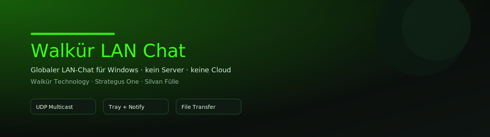
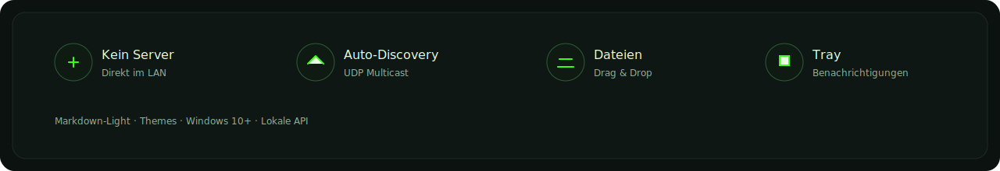
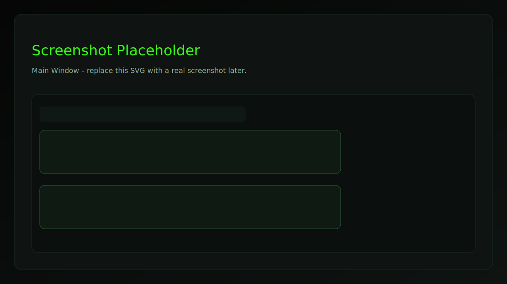
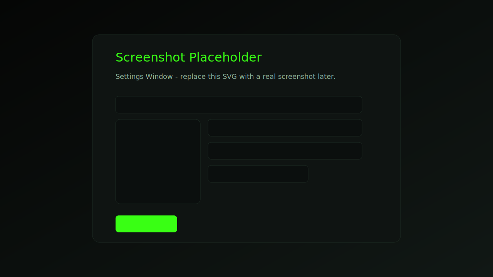
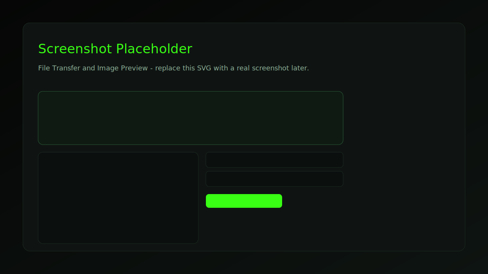

# Walkür LAN Chat

<div align="center">
  
  <p><strong>Globaler LAN-Chat für Windows — klicki-bunti, schnell, ohne Server.</strong></p>
  <p>Walkür Technology · Strategus One · Silvan Fülle</p>
  <p>
    <a href="API.md">API</a> ·
    <a href="#features">Features</a> ·
    <a href="#funktionen-im-detail">Funktionen</a> ·
    <a href="#screenshots">Screenshots</a> ·
    <a href="#start">Start</a> ·
    <a href="LICENSE.md">Lizenz</a>
  </p>
</div>

Walkür LAN Chat ist ein winziges Windows-Tool für den lokalen Netzwerk-Chat: ein globaler Raum, automatische Discovery per UDP Multicast, Dateitransfer per lokalem HTTP, Tray-Modus, Markdown-Light — und ein dunkles Neon-UI im Walkür-Style. Kein Server, kein Cloud-Service, kein Internet. Einfach starten und loschatten.

<div align="center">
  
</div>

## Features
- Globaler LAN-Chat (Broadcast/Multicast): alle sehen denselben Raum.
- Auto-Discovery im Intranet (HELLO alle 2 Sekunden, Offline nach 8 Sekunden).
- Dateitransfer: Drag-and-Drop, Download per HTTP-URL, beliebige Dateitypen.
- Markdown-Light: **bold**, *italic*, `code`, Links, Listen.
- Tray-Modus: X = verstecken, neue Nachrichten mit Tray-Popup + Sound.
- Benutzername + Avatar, Themes, moderne Chat-Bubbles.
- Kein Admin nötig, Windows 10+ kompatibel.

## Funktionen im Detail
- Chat & Formatierung: Markdown-Light mit klickbaren Links, sicheres Fallback, Textlimit 8 KB.
- Interaktionen: Antworten, Reaktionen, Edit/Undo, Pin-Leiste mit Sprung zur Nachricht.
- Presence: Online-Liste, letzter Online-Zeitpunkt, "tippt..." Status.
- Dateien: Drag-and-Drop, lokaler HTTP-Download, Fortschritt + Retry, Inline-Bildvorschau.
- Offline Queue: Nachrichten werden bei Netzwerkverlust gepuffert und später gesendet.
- Persistenz: History + Attachments/Avatare unter `%USERPROFILE%\.walkuer-lanchat\`.

## Warum es besonders ist
Kompakt, schnell, lokal. Für Teams, Studios, Werkstatt, Büro, LAN-Parties oder Intranet-Labs. Kein Setup, kein Account, keine Serverkosten. Einfach "klicky-bunti" und produktiv.

## Screenshots
<div align="center">
  
  
  
</div>

Platzhalter: Ersetze die SVGs später durch echte Screenshots (gleiches Dateinamen-Format).

## Start
### Dev
1. `run_dev.bat`

### Build (EXE)
1. `build_exe.bat`
2. Ergebnis: `dist\WalkuerLanChat.exe`

## Nutzung
1. App auf zwei PCs im gleichen LAN starten.
2. Windows-Firewall kann beim ersten Start fragen: Zugriff erlauben.
3. Chatten, Dateien ziehen, fertig.

## Einstellungen
- Benutzername frei wählbar.
- Avatar wählen oder entfernen (Vorschau rund).
- Theme-Auswahl: Standard, Pink Pupa, Midnight Blue, Mono Minimal.
- Sound bei neuen Nachrichten (an/aus).
- Tray-Popups (an/aus).
- Lokale API aktivieren: URL + Token anzeigen, Token neu generieren.

## Technik (Kurz)
- Python 3.11+, PySide6 (Qt)
- UDP Multicast Discovery + Global Chat
- Lokaler HTTP-Server nur für Attachments
- Nachrichtendedup mit UUID + Cache
- Tray via QSystemTrayIcon

## API (lokal)
Die lokale API macht es möglich, die App per Skript/Agent zu steuern. Sie läuft auf `127.0.0.1` und ist standardmäßig deaktiviert.

**Aktivieren**
1. Einstellungen öffnen → "API aktivieren (localhost)".
2. API-URL und Token werden angezeigt (Token kann neu erzeugt werden).

**Auth**
- Header: `X-API-Token: <token>`  
oder  
- Query: `?token=<token>`

**Wichtige Endpoints**
- `GET /api/v1/` Self-Description
- `GET /api/v1/status` Status + API-URL
- `GET /api/v1/peers` Online-Peers
- `GET /api/v1/messages?limit=50` History
- `POST /api/v1/send` Text senden
- `POST /api/v1/send/file` Datei senden (lokaler Pfad)
- `POST /api/v1/pin` / `POST /api/v1/unpin`
- `POST /api/v1/edit` / `POST /api/v1/undo`

**Quickstart (PowerShell)**
```powershell
$token = "<token>"
$base = "http://127.0.0.1:<port>/api/v1"
curl.exe "$base/status"
curl.exe -H "X-API-Token: $token" -H "Content-Type: application/json" `
  -d "{\"text\":\"Hallo LAN\"}" "$base/send"
```

Details in `API.md`.

## Suche & Keywords
LAN Chat, Windows LAN Chat, LAN Messenger, Intranet Chat, Local Chat, UDP Multicast, Peer-to-Peer Chat, Broadcast Chat, No Server Chat, File Transfer LAN, Windows Tray Chat, PySide6, Python 3.11, Walkür Technology, Strategus One, Silvan Fülle

## Attribution & Lizenz
Freie Nutzung für nicht-kommerzielle Zwecke. Kommerzielle Nutzung ist verboten.  
Wenn du Walkür LAN Chat nutzt oder weitergibst, ist die Attribution Pflicht:
- Walkür Technology
- Strategus One
- Silvan Fülle
- https://walkuer.tech
- https://strategus.one

Details in `LICENSE.md`.
